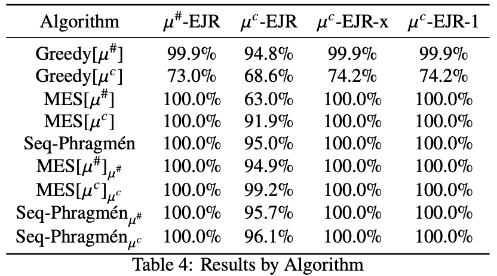

Code for our masters project.

The code analyzes how well voting rules satisfy EJR on real data.

# Results
Core findings summarized as

# Running

Run `src/main/compute_winning_sets.py` to produce the winning sets for all elections in `data/elections`.

Run `src/main/checker.py` to find ejr, ejr-x, and ejr-1 violations for all the winning sets. 

Run `src/main/analyze.py` to produce a graphs and tables in latex format, showing the result of the `checker`.

# Notes

This repo also includes algorithms for pjr and fjr, however they are to slow to be run for large instances. 
